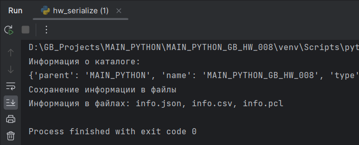
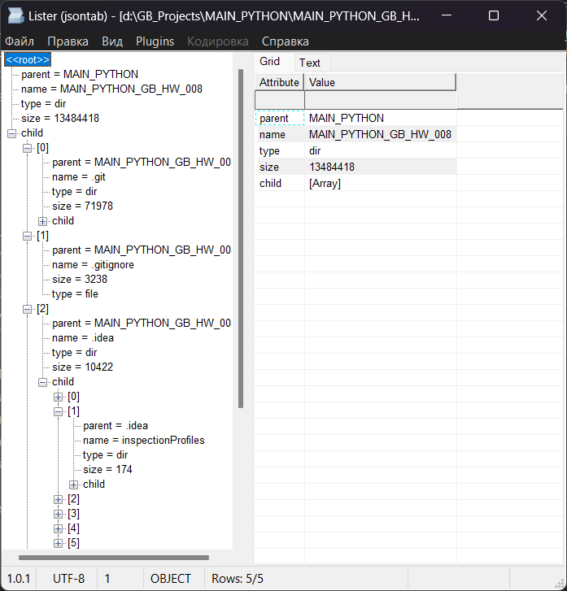
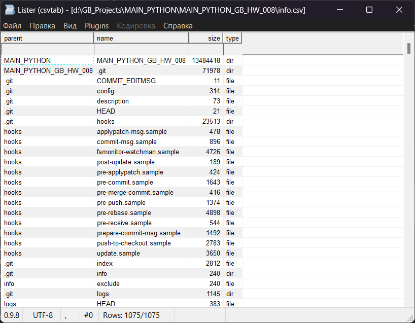
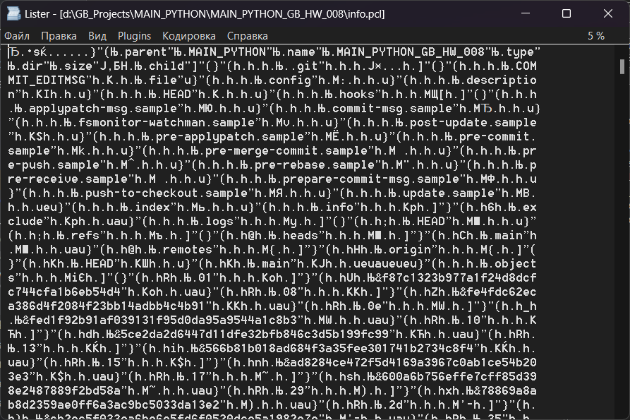

# Погружение в Python. Сериализация

## Задание 1

Напишите функцию, которая получает на вход директорию и рекурсивно обходит её и все вложенные директории.
Результаты обхода сохраните в файлы json, csv и pickle.
- Для дочерних объектов указывайте родительскую директорию.
- Для каждого объекта укажите файл это или директория. 
- Для файлов сохраните его размер в байтах, а для директорий размер файлов в ней с учётом всех 
вложенных файлов и директорий.

**Пример выполнения**

Файл JSON

Файл CSV

Файл PICLE

## Задание 2

Соберите из созданных на уроке и в рамках домашнего задания функций пакет для работы с файлами разных форматов.

Подготовлен пакет hw_pack